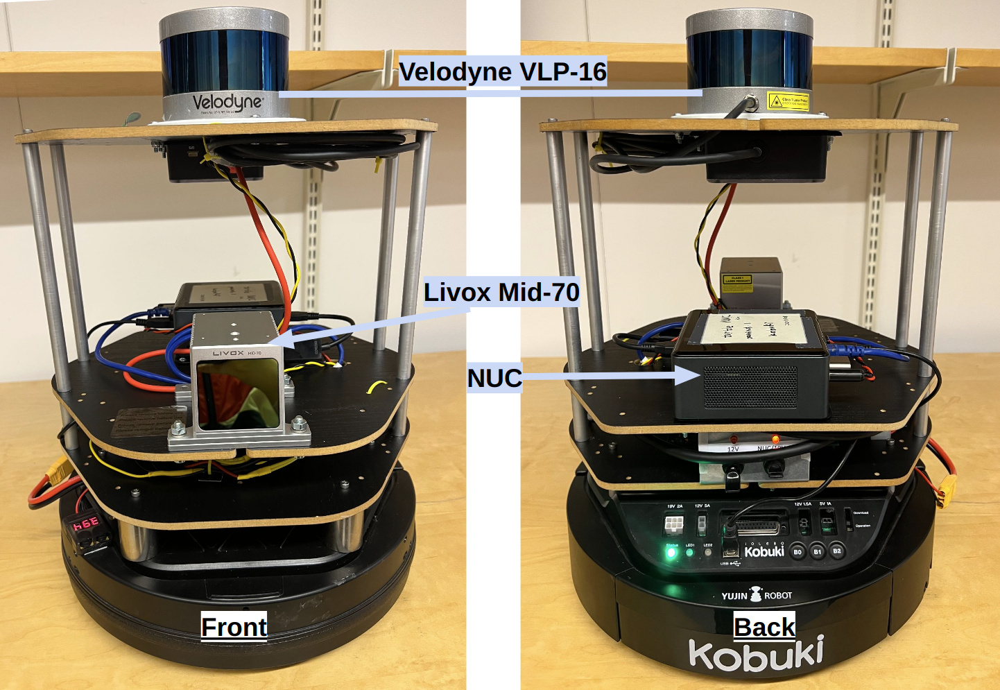

KTH-RPL kobuki robot
---

Why we need this? 

1. kobuki is produced in 2015 which is really far away, this repo will only provide the thing you can run the kobuki robot [maunal control using the keyboard or remote control].
2. This is for us to collect our own dataset **mainly indoor**, or tested our algorithm in a **real robot**. 
3. IF YOU DIRECTLY USE THE KOBUKI FROM KIN, there is no need to set up from this [README](assets/install/README.md). Otherwise, Please go [install readme](assets/install/README.md) to setup

Test System: Ubuntu 20.04 noetic

Test Day: 2023/03/09 17:53

Author: Kin ZHANG [https://kin-zhang.github.io/](https://kin-zhang.github.io/)

---

Sensor setup:

- Velodyne VLP-16
- Livox Mid-70

Will add more... like camera (rgb/depth).


Picture of it:



## Build & Run

NOTE AGAIN: If you reinstall the whole thing. Please check [install readme](assets/install/README.md).

When you open the NUC, Here are the path the driver and kobuki code are.

```bash
turtle@turtle-nuc /home/turtle/workspace/kobuki_ws
```

Control Manual, Here is the button said [F710 is the gampad we used]:

- START : to start the robot, if you want to STOP, press `BACK`
- BACK : to stop robot
- MODE : PLEASE **<u>TURN OFF</u>** THE MODE
- RB && RIGHT mini sticks: forward speed
- RB && LEFT mini sticks: left/right turn
 

## Build

```bash
cd /home/turtle/workspace/kobuki_ws
catkin build
source /home/turtle/workspace/kobuki_ws/devel/setup.zsh
```

## Run

```bash
# roscore & sensor driver for velodyne and livox
./home/turtle/workspace/kobuki_ws/src/kobuki/assets/run_sensor.sh

# kobuki driver for run
./home/turtle/workspace/kobuki_ws/src/kobuki/assets/run_kobuki.sh

```

If you want to record thing, Please check this script file also:
```bash
./home/turtle/workspace/kobuki_ws/src/kobuki/assets/record.sh
```

### Optiona 2: Run it one by one:
1. Open Joy:
   ```bash
   roslaunch teleop_twist_joy teleop.launch
   ```

2. Open kobuki:
   ```bash
   roslaunch kobuki_node minimal.launch
   ```

3. Open Livox [If you setup from the start, please correct the ip addr in Network setting]:
   ```bash
   roslaunch livox_ros_driver livox_kobuki.launch
   ```

4. Open Velodyne [If you setup from the start, please correct the ip addr in Network setting]:
   ```bash
   roslaunch velodyne_pointcloud VLP16_points.launch
   ```

## Demo of Running and sensor

Here are some demo we used in kobuki or the data kobuki collected.

### SLAM

Do some slam thing, this simple package you can try [simple_ndt_slam](https://github.com/Kin-Zhang/simple_ndt_slam). This one is in TR14 6 floor:
https://user-images.githubusercontent.com/35365764/225727506-d20d1cfa-a122-4ce5-be35-5b233c275672.mp4

### Perception

TODO

### DUFOMap

TODO

# Issues 

Some problem you may met, record here:

1. Cannot open /dev/ttyUSB0: Permission denied #26 https://github.com/esp8266/source-code-examples/issues/26

2. serial problem: https://stackoverflow.com/questions/11403932/python-attributeerror-module-object-has-no-attribute-serial

3. Kobuki: malformed sub-payload detected: https://github.com/yujinrobot/kobuki/issues/382